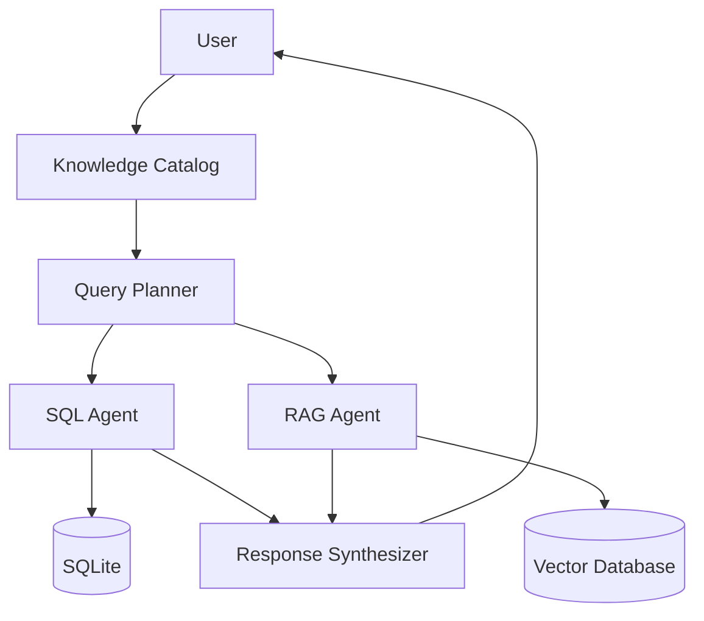
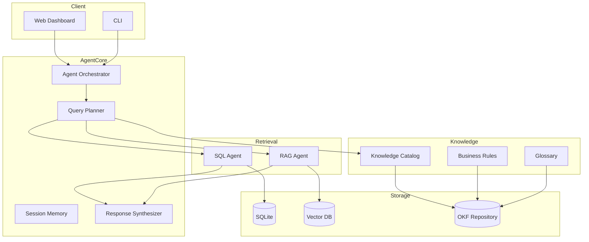
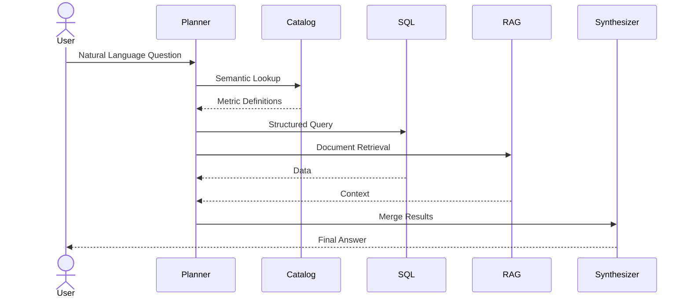

# Data and knowledge Query Engine (DQE)

> A Semantic Knowledge Operating System for Structured Data, Documents, and Agentic Query Execution

DQE(Data and Knowledge Query Engine)는 사용자의 자연어 질문을 해석하여

* 정형 데이터베이스(SQL)
* 비정형 문서(RAG)
* 비즈니스 규칙
* 지식 카탈로그(Knowledge Catalog)

를 통합적으로 조회하고,

Agent 기반 Query Planning 과정을 통해 최종 답변을 생성하는 Knowledge Operating System이다.

---

> Semantic Query Engine for Structured Data, Documents, and Knowledge Catalogs

[]()
[]()
[]()
[]()

---

# Why DQE?

Most AI systems today fall into one of two categories:

1. Text-to-SQL
2. RAG (Retrieval-Augmented Generation)

Both approaches are useful.

However neither understands business meaning.

Users ask:

> Show me VIP customer growth this year.

But databases only know:

```sql
customers.total_purchase
````

The missing layer is semantics.

DQE introduces a Semantic Knowledge Layer between user questions and data sources.

```text
User Question

↓

Knowledge Catalog

↓

Query Planner

↓

Execution Graph

↓

SQL + Documents

↓

Answer
```

---

# Architecture Overview



---

# Core Concepts

## Knowledge Catalog

A Knowledge Catalog translates business concepts into executable data definitions.

Example:

```yaml
entity: Customer

metrics:

  vip_customer:
    definition: total_purchase > 1000000

  active_customer:
    definition: order_count > 3
```

Users ask:

```text
Show VIP customers
```

The system understands:

```sql
total_purchase > 1000000
```

---

## Query Planner

Instead of generating SQL directly:

```text
Question

↓

Plan

↓

Execute

↓

Answer
```

DQE first generates an execution plan.

Example:

```yaml
plan:

  - load_metric_definition

  - generate_sql

  - retrieve_documents

  - calculate_growth_rate

  - synthesize_answer
```

---

## Multi-Hop Query Execution

Complex questions require multiple reasoning steps.

Example:

Question:

> Compare this year's VIP customer growth against last year.

Execution:

1. Load VIP definition
2. Query 2025 customer count
3. Query 2026 customer count
4. Calculate growth rate
5. Generate explanation

---

# System Architecture



---

# Query Flow



---

# Open Knowledge Format (OKF)

DQE uses OKF (Open Knowledge Format) as its semantic layer.

OKF stores:

* Entities
* Metrics
* Business Rules
* Domain Glossaries
* Query Templates
* Agent Prompts

Example:

```yaml
entity: Order

description: Customer Orders

columns:

  order_id:
    description: Order Identifier

  total_amount:
    description: Total Purchase Amount

metrics:

  monthly_sales:
    formula: SUM(total_amount)
```

---

# Repository Structure

```text
knowledge/

├── catalog/
│   ├── customer.okf
│   ├── order.okf
│   └── product.okf
│
├── metrics/
│   ├── sales.okf
│   ├── retention.okf
│   └── growth.okf
│
├── business_rules/
│   ├── vip_customer.okf
│   └── refund_policy.okf
│
├── glossary/
│   └── domain_terms.okf
│
├── prompts/
│   ├── sql_generation.okf
│   └── answer_style.okf
│
└── examples/
```

---

# Example

Question:

```text
What is the average purchase amount of VIP customers
during the last 3 months?
```

Execution Plan:

```yaml
1. Load VIP definition
2. Generate SQL
3. Execute SQL
4. Aggregate result
5. Generate answer
```

Generated SQL:

```sql
SELECT AVG(total_purchase)
FROM customers
WHERE total_purchase > 1000000
AND purchase_date >= DATE('now','-3 month');
```

Response:

```text
The average purchase amount of VIP customers
during the last 3 months is 1,253,000 KRW.
```

---

# Supported LLM Providers

| Provider | Status  |
| -------- | ------- |
| Qwen 2.5 | ✅       |
| Qwen 3.5 | ✅       |
| Gemini   | ✅       |
| Claude   | ✅       |
| OpenAI   | Planned |

---

# Evaluation Framework

Metrics:

* Exact Match (SQL)
* Execution Accuracy
* Latency
* Token Cost
* GPU Memory Usage

```text
Question

↓

LLM

↓

Generated SQL

↓

Execution

↓

Metrics
```

---

# Roadmap

## Phase 1

Text-to-SQL

RAG

SQLite

## Phase 2

Knowledge Catalog

Business Rules

Semantic Layer

## Phase 3

Agentic Query Planner

Execution Graph

Multi-Hop Reasoning

## Phase 4

Knowledge Graph

Decision Memory

Engineering Memory

Design Memory

## Phase 5

Knowledge Operating System

Self-Evolving Knowledge Base

---

# Long-Term Vision

DQE is not just another Text-to-SQL system.

It is an attempt to build:

```text
Database

↓

Knowledge Catalog

↓

Knowledge Graph

↓

Knowledge Operating System
```

where knowledge itself becomes executable.