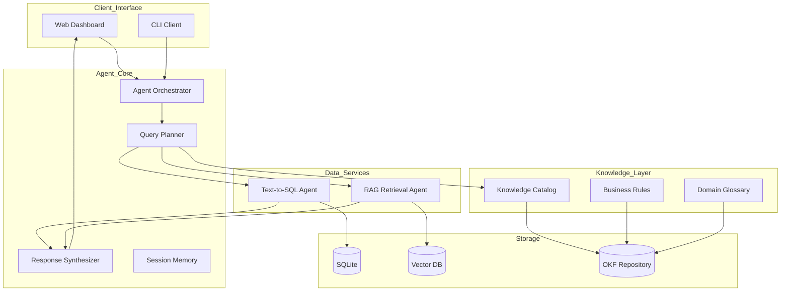
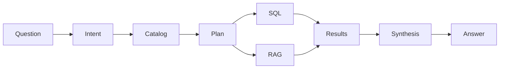
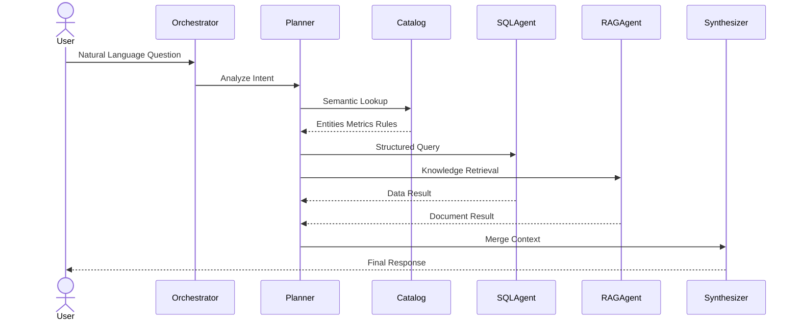

# Knowledge Query Engine (KQE)

> A Semantic Knowledge Operating System for Structured Data, Documents, and Agentic Query Execution

KQE(Knowledge Query Engine)는 단순한 RAG 시스템이나 Text-to-SQL 엔진이 아니다.

KQE는 사용자의 자연어 질문을 해석하여

* 정형 데이터베이스(SQL)
* 비정형 문서(RAG)
* 비즈니스 규칙
* 지식 카탈로그(Knowledge Catalog)

를 통합적으로 조회하고,

Agent 기반 Query Planning 과정을 통해 최종 답변을 생성하는 Knowledge Operating System이다.

---

# Vision

기존 시스템은 데이터를 저장한다.

KQE는 의미(Semantics)를 저장한다.

```text
Traditional BI

User
 ↓
SQL
 ↓
Database

--------------------------------

Knowledge Query Engine

User
 ↓
Semantic Catalog
 ↓
Query Planner
 ↓
Execution Graph
 ↓
Data Sources
 ↓
Answer
```

---

# Core Design Principles

## 1. Semantic First

사용자는

"orders.customer_id"

를 알 필요가 없다.

대신

"VIP 고객"

"최근 3개월 구매액"

"재구매율"

같은 비즈니스 의미를 사용한다.

KQE는 이를 Knowledge Catalog를 통해 해석한다.

---

## 2. Agentic Query Planning

질문을 즉시 SQL로 변환하지 않는다.

먼저 실행 계획(Query Plan)을 생성한다.

예:

질문

"최근 매출과 매출 계산 기준을 알려줘"

실행계획

```yaml
plan:

  - sql:
      metric: monthly_sales

  - rag:
      document: sales_kpi

  - synthesize:
      combine
```

---

## 3. Unified Knowledge Layer

SQL

RAG

Business Rules

Glossary

를 하나의 Semantic Layer로 통합한다.

---

# System Architecture



---

# Knowledge Flow Architecture



---

# Knowledge Catalog

Knowledge Catalog는 프로젝트의 핵심 구성 요소이다.

Catalog는 데이터베이스 스키마를 비즈니스 의미로 변환한다.

예:

```yaml
entity: Customer

description: 고객

columns:

  customer_id:
    meaning: 고객 식별자

  total_purchase:
    meaning: 누적 구매 금액

metrics:

  vip_customer:

    definition: total_purchase > 1000000

  active_customer:

    definition: order_count > 3
```

사용자는

"VIP 고객"

이라고 질문하고

시스템은

```sql
total_purchase > 1000000
```

를 자동으로 이해한다.

---

# Query Planning Engine

Planner는 질문을 실행 가능한 Graph로 변환한다.

예:

질문

"올해 VIP 고객 증가율은?"

실행계획

```yaml
steps:

  - load_vip_definition

  - query_2025_vip_count

  - query_2026_vip_count

  - calculate_growth_rate

  - generate_answer
```

Planner는 SQL 생성기보다 상위 계층이다.

---

# Multi-Hop Query Execution

복잡한 질문은 여러 단계로 수행된다.

```text
Question

↓

Find KPI Definition

↓

Generate SQL

↓

Execute Query

↓

Retrieve Supporting Documents

↓

Calculate Derived Metrics

↓

Generate Answer
```

이를 Multi-Hop Query Execution이라 부른다.

---

# Query Execution Sequence



---

# Knowledge Repository Structure

```text
knowledge/

├── catalog/
│   ├── customer.okf
│   ├── order.okf
│   └── product.okf
│
├── metrics/
│   ├── sales.okf
│   ├── retention.okf
│   └── growth.okf
│
├── business_rules/
│   ├── vip_customer.okf
│   ├── refund_policy.okf
│   └── loyalty_program.okf
│
├── glossary/
│   └── domain_terms.okf
│
├── prompts/
│   ├── sql_generation.okf
│   └── answer_style.okf
│
└── examples/
    └── sample_queries.okf
```

---

# Example End-to-End Query

사용자 질문

```text
최근 3개월 VIP 고객의 평균 구매 금액은?
```

Planner

```yaml
1. Load VIP definition
2. Generate SQL
3. Execute query
4. Aggregate average purchase
5. Generate explanation
```

SQL

```sql
SELECT
AVG(total_purchase)
FROM customers
WHERE total_purchase > 1000000
AND purchase_date >= DATE('now','-3 month');
```

Response

```text
최근 3개월 VIP 고객의 평균 구매 금액은
1,253,000원입니다.
VIP 고객은 누적 구매 금액이 100만원 이상인 고객으로 정의됩니다.
```

---

# Future Roadmap

Phase 1

Text-to-SQL + RAG Integration

Phase 2

Knowledge Catalog

Semantic Layer

Business Rule Engine

Phase 3

Agentic Query Planning

Execution Graph

Multi-Hop Reasoning

Phase 4

Knowledge Graph

Self-Evolving Knowledge Base

Decision Memory

Design Memory

Engineering Memory

Phase 5

Knowledge Operating System (KOS)

```
```
