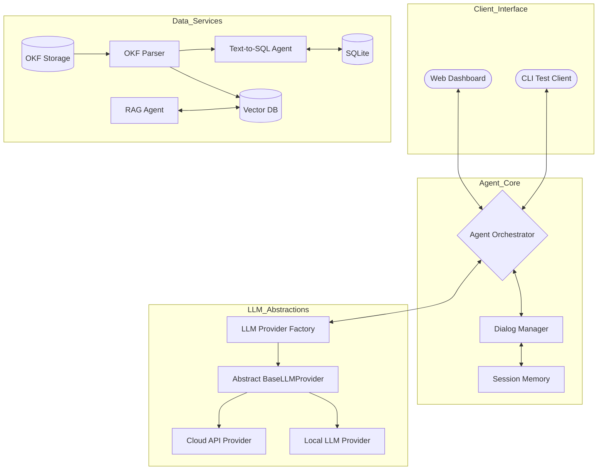

# Data Query and Response Engine (DQE)
> **OKF 기반 지식 모델링, Multi-turn AI Agent 및 다중 LLM 어댑터 구조 설계 문서**

본 문서는 오픈 지식 포맷(OKF, Open Knowledge Format) 지식 문서 체계를 활용하여 사용자의 자연어 질문을 해석하고, 정형 데이터베이스(SQLite) 및 비정형 데이터(RAG)를 통합 조회·응답하는 **DQE 엔진의 상세 설계 및 프로젝트 계획서**입니다.

특히 POC 단계에서의 원활한 검증을 위해 **SQLite 기반 데이터 환경**과 **로컬(Qwen 2.5/3.5 on nano-vllm) / 클라우드(API) LLM 모델 간의 즉각적인 교체 및 성능 평가가 가능한 플러그인 아키텍처**를 설계하였습니다.

---

## 1. DQE 전체 시스템 아키텍처 (System Architecture)

DQE 엔진은 LLM 모델의 의존성을 분리하기 위해 **Provider 패턴(Adapter Pattern)**을 적용하여 설계되었습니다. 이를 통해 코드 수정 없이 설정 파일 변경만으로 로컬 LLM(nano-vllm)과 클라우드 LLM API를 상호 전환할 수 있습니다.
# System Architecture



---

## 2. LLM 평가용 플러그인 구조 및 디렉토리 설계

다양한 LLM 엔진(Cloud API 및 local LLM)의 성능 지표(정확도, 응답 속도, 토큰 소비량)를 정확히 비교 평가하기 위해 다음과 같이 계층적으로 디렉토리를 배치합니다.

### 2.1. 프로젝트 디렉토리 트리 (Project Directory Tree)
```text
D:\dqe\
├── config/
│   ├── settings.yaml          # LLM 모델 설정 (provider, endpoint, temperature 등)
│   └── database.yaml          # SQLite 연결 및 스키마 경로 설정
├── knowledge/                 # OKF(Open Knowledge Format) 지식 베이스
│   ├── db_schemas/
│   │   └── orders_table.md    # 주문 테이블 물리 스키마 정의 문서
│   ├── business_rules/
│   │   └── sales_kpi.md       # 매출 집계 연산 규칙 정의 문서
│   └── domain_lexicons/
│       └── glossary.md        # 사투리 및 도메인 사전
├── src/
│   ├── agents/
│   │   ├── orchestrator.py    # 에이전트 라우팅 및 흐름 제어
│   │   ├── sql_agent.py       # SQL 쿼리 생성 및 실행 에이전트
│   │   └── rag_agent.py       # 비정형 문서 조회 에이전트
│   ├── core/
│   │   ├── memory.py          # Multi-turn 세션 정보 관리
│   │   └── okf_parser.py      # OKF 마크다운 및 YAML 파서
│   ├── database/
│   │   ├── db_manager.py      # SQLite 연결 및 트랜잭션 관리
│   │   └── seed_data.sql      # POC용 가상 테이블 및 데이터 인입 쿼리
│   └── llm/                   # LLM 추상화 모듈 (Adapter Pattern)
│       ├── base.py            # BaseLLMProvider (추상 인터페이스 정의)
│       ├── cloud_provider.py  # Cloud LLM API 어댑터
│       └── local_provider.py  # nano-vllm / Local LLM API 어댑터
├── tests/                     # TDD 기반 평가 모듈
│   ├── dataset/
│   │   └── eval_cases.json    # [질문 - 정답 SQL - 예상 결과] 쌍의 테스트 셋
│   └── evaluate.py            # LLM 모델별 자동 평가 실행 스크립트
├── README.md                  # 설계 및 프로젝트 계획서
└── requirements.txt
```

### 2.2. LLM 어댑터 인터페이스 설계 (`src/llm/base.py`)
```python
from abc import ABC, abstractmethod
from typing import Dict, Any, List

class BaseLLMProvider(ABC):
    """
    다양한 LLM API 및 로컬 실행 엔진(nano-vllm)을 단일 규격으로 처리하기 위한 추상 기본 클래스
    """
    
    @abstractmethod
    def generate(self, prompt: str, system_instruction: str = "") -> str:
        """단발성 텍스트 생성 인터페이스"""
        pass
        
    @abstractmethod
    def chat(self, messages: List[Dict[str, str]]) -> Dict[str, Any]:
        """Multi-turn 대화(세션 기억 포함) 수행 인터페이스"""
        pass
```

---

## 3. POC 검증 환경 설계

### 3.1. 관계형 데이터베이스: SQLite
POC 단계에서는 서버 구성이 불필요하고 이식성이 뛰어난 **SQLite** 파일 데이터베이스를 타겟으로 동작시킵니다.
* **데이터 무결성 검증**: 데이터 조회(SELECT)만 허용하는 전용 DB 커넥터 풀을 생성하여 비정상 쿼리(DML)에 대한 예외 처리 설계.
* **가상 스키마 구축**: `src/database/seed_data.sql`에 시나리오에 맞는 가상 `orders` (주문), `customers` (고객), `products` (상품) 테이블 구조와 1만 건 이상의 모의 데이터를 생성하여 쿼리 정확도 확보.

### 3.2. Local LLM 실행: nano-vllm (Windows CUDA 가속)
Windows 데스크톱 환경에서 가볍고 신속한 local LLM 서빙을 위해 **nano-vllm** 엔진을 활용합니다.
* **하드웨어 가속**: CUDA 및 cuBLAS(cuUtil) 라이브러리를 동원해 Qwen 2.5 (또는 3.5) 7B/14B 모델의 추론 성능 극대화.
* **인프라 구조**: `nano-vllm`이 OpenAI와 호환되는 로컬 HTTP API 서버(예: `localhost:8000`)를 제공하도록 서빙 스크립트를 구성하고, `LocalLLMProvider`는 이를 연계해 추론 요청을 전달.

---

## 4. LLM 모델별 성능 평가 및 벤치마크 설계 (`tests/evaluate.py`)

다양한 LLM 엔진의 성능을 공정하고 객관적으로 평가하기 위해 다음과 같이 평가 시스템을 구성합니다.

```text
                     [ 평가 케이스 데이터셋 (eval_cases.json) ]
                                       │
                                       ▼
  ┌─────────────────────────────────────────────────────────────────────────┐
  │                           평가 실행기 (evaluate.py)                      │
  └────────────────────┬───────────────────────────────┬────────────────────┘
                       │                               │
                       ▼                               ▼
            [ Local LLM (nano-vllm) ]       [ Cloud API (Gemini/Claude) ]
                       │                               │
                       └───────────────┬───────────────┘
                                       ▼
                     [ 결과 비교 분석기 (Metrics Collector) ]
                                       │
                       ┌───────────────┼───────────────┐
                       ▼               ▼               ▼
                   [정확도]         [속도]          [비용]
                 SQL 일치율      Latency (초)     토큰 소비량
```

### 4.1. 평가 메트릭 (Evaluation Metrics)
1. **SQL 구문 일치율 (Exact Match - EM)**: 생성된 SQL 구문이 정답 SQL과 논리적으로 일치하는지 평가.
2. **실행 결과 일치율 (Execution Accuracy - EX)**: SQLite 데이터베이스에서 생성된 SQL을 수행했을 때 리턴된 결과 집합(데이터 셀 값)이 정답 SQL의 실행 결과와 정확히 일치하는지 검증.
3. **지연 시간 (Latency)**: 쿼리 입력부터 최종 텍스트 요약 답변 완성까지 걸리는 시간(초) 측정.
4. **추론 리소스 소비 (GPU VRAM / Token Cost)**: nano-vllm의 GPU VRAM 점유량 및 Cloud API의 토큰 단가 기준 비용 효율성 비교.

---

## 5. DQE 단계별 프로젝트 계획 (Project Timeline)

| 단계 | 주요 태스크 | 상세 작업 항목 | 산출물 |
| :--- | :--- | :--- | :--- |
| **W1: 준비 및 설계** | 환경 구성 및 지식 정의 | - Windows GPU 개발 환경에 nano-vllm 및 CUDA 세팅<br>- SQLite DB 설계 및 가상 데이터 시나리오 생성<br>- 핵심 데이터 테이블 스키마에 맞춰 OKF Markdown 문서 기획 및 작성 | `seed_data.sql`, `*.md` (OKF), `settings.yaml` |
| **W2: 핵심 구현** | 에이전트 & 어댑터 개발 | - `BaseLLMProvider` 추상화 및 Local/Cloud 구체 어댑터 코딩<br>- OKF 파서 모듈 및 SQLite 연결 세션 개발<br>- Text-to-SQL 쿼리 빌더 및 Multi-turn 대화 관리 인터페이스 구현 | `base.py`, `okf_parser.py`, `sql_agent.py`, `orchestrator.py` |
| **W3: 평가 및 검증** | 로컬 LLM 벤치마크 | - 평가용 테스트 셋 구축 (`eval_cases.json`) 및 `evaluate.py` 구현<br>- Local Qwen (nano-vllm) 모델의 SQL 생성 정확도/속도 평가<br>- Cloud API 모델과의 성능 벤치마크 리포트 작성 | `eval_cases.json`, `LLM_Performance_Report.md` |
| **W4: 서비스 패키징** | 대시보드 연동 & 상용화 준비| - 웹 브라우저 기반 Chat UI 대시보드(Text 기반 POC) 패키징<br>- 상용화 대응을 위한 오디오(STT) 스트리밍 연동 인터페이스 설계 고도화 | Web UI App, `README.md` 최종본 |
