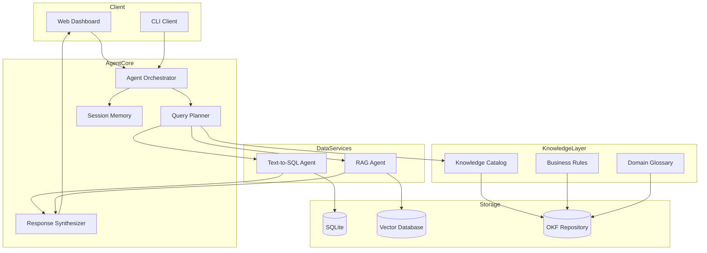
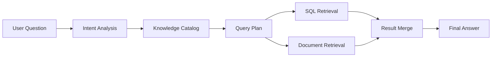
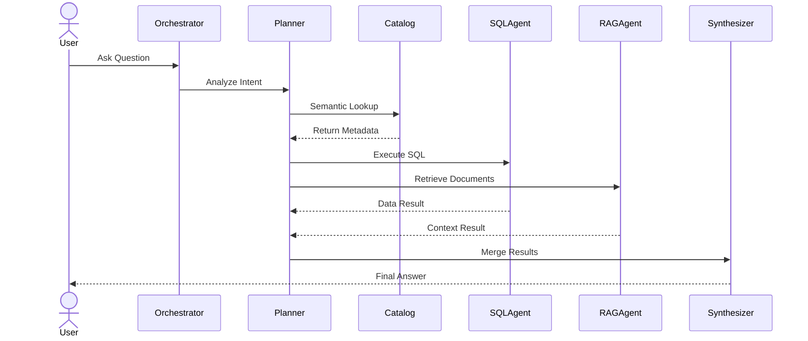
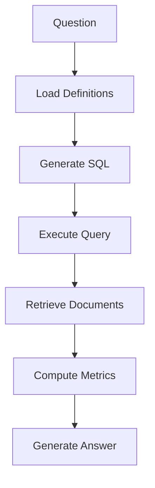
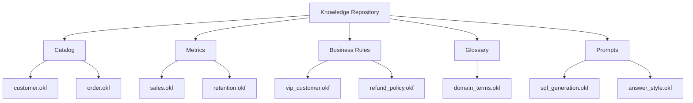

# Knowledge Query Engine (KQE)

> A Semantic Knowledge Operating System for Structured Data, Documents, and Agentic Query Execution

## Vision

KQE는 자연어 질문을 Knowledge Catalog, Query Planner, SQL/RAG 실행을 통해 처리하는 Knowledge Operating System이다.

---

# System Architecture

---

# Knowledge Flow Architecture

---

# Query Execution Sequence

---

# Multi-Hop Query Planning

---

# Knowledge Repository Structure

